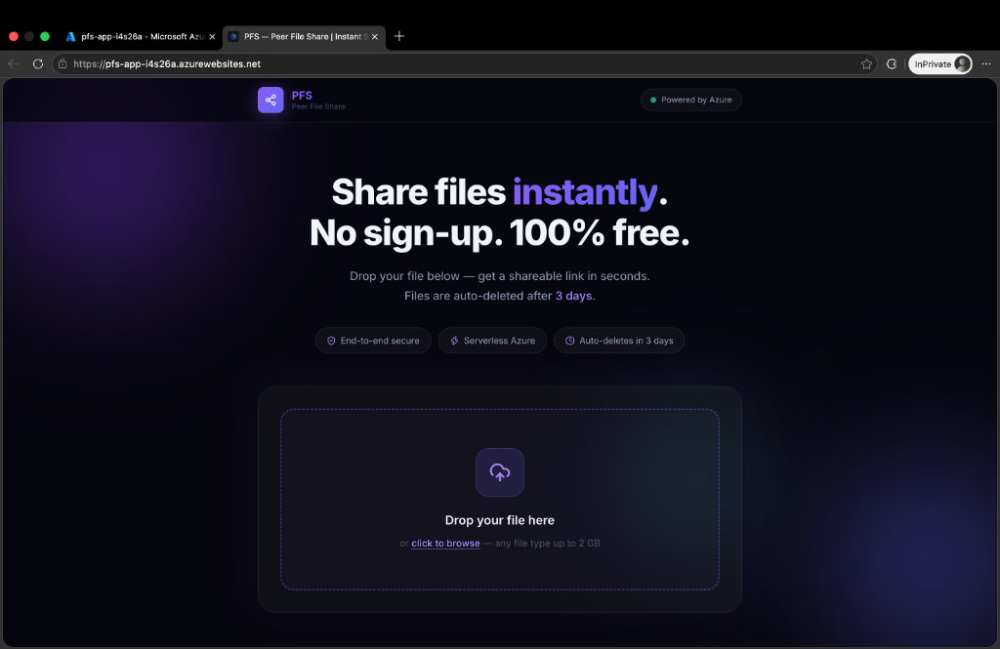
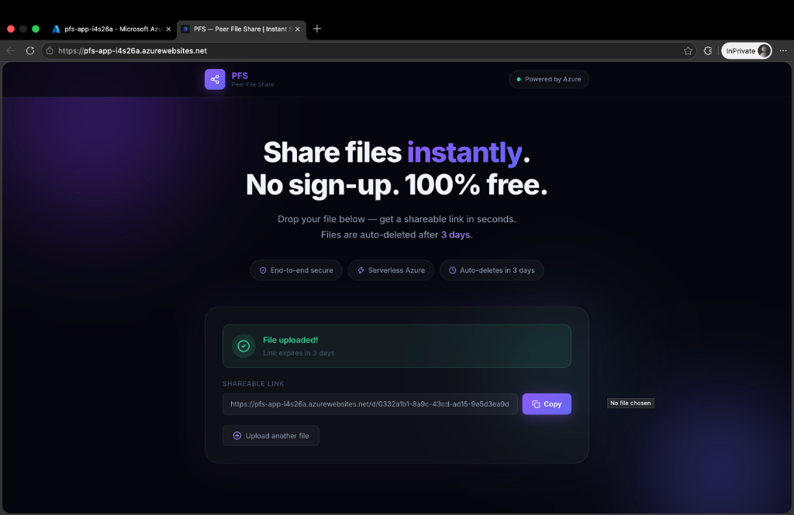
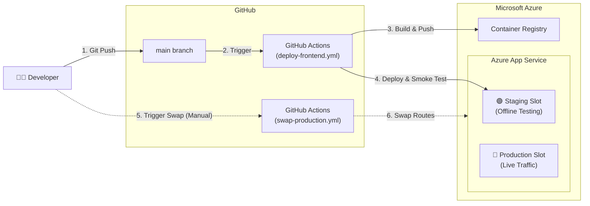
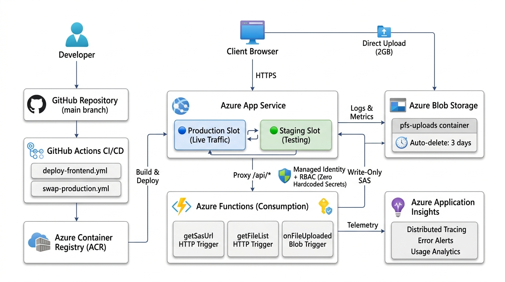
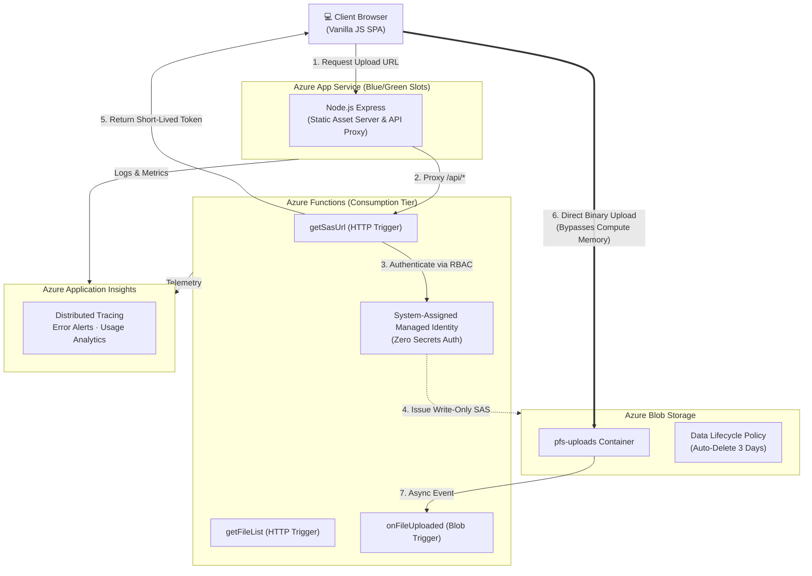

# Peer File Share (PFS)

> A modern, serverless file-sharing application built entirely on Microsoft Azure.  
> Drop a file → get a secure shareable link → files auto-delete after **3 days**.

<p align="center">
  
  
</p>

PFS is an enterprise-grade reference architecture demonstrating how to leverage Azure Serverless technologies to build highly scalable, cost-optimized applications. 

By utilizing **Write-Only SAS Tokens**, the frontend client uploads massive 2 GB+ files directly to Azure Blob Storage. This pattern completely bypasses the server memory limits and timeout constraints typical of Azure Functions and App Services, allowing the application to scale infinitely while costing nearly $0 to operate at rest.

---

## ✨ Enterprise Architecture Highlights

- **Zero-Trust Security**: Built entirely with **Azure Managed Identities** and Role-Based Access Control (RBAC). The production environment contains absolutely zero hardcoded connection strings or storage keys.
- **Serverless Scalability**: The backend is powered by Azure Functions on a Consumption plan, allowing it to scale instantly from zero to thousands of concurrent requests.
- **Cost Optimization**: Direct-to-blob uploads mean the backend only processes lightweight JSON metadata requests, dramatically reducing compute execution costs.
- **Automated Lifecycle Management**: Blob Storage is configured with a strict data retention policy that automatically purges files older than 3 days, eliminating manual database cleanup and runaway storage costs.
- **Zero-Downtime Releases & IaC**: Infrastructure as Code (Terraform with secure Remote State in Azure Blob Storage) provisions Azure App Service Deployment Slots, enabling automated blue-green deployments via GitHub Actions.

---

## 🔵 🟢 Blue-Green Deployments

PFS utilizes **Azure App Service Deployment Slots** for true zero-downtime releases. This is fully automated via our GitHub Actions:

1. **Continuous Deployment:** Any push to `main` triggers a build of the Docker container, which is deployed to an isolated `staging` slot (the Green environment).
2. **Automated Smoke Tests:** The CI/CD pipeline automatically runs a health check against the staging environment. Production users experience zero disruption.
3. **Decoupled Release:** When you are ready to go live, you manually trigger the **Swap to Production** workflow. Azure instantly swaps the underlying IP routes, directing all live traffic to the new code instantly.



---

## 🏗️ System Architecture





---


## 🚀 End-to-End Setup & Provisioning

The entire Azure infrastructure (App Services, Functions, Storage, RBAC Roles) is codified in Terraform for rapid, reproducible deployments.

👉 **[Read the comprehensive End-to-End Setup Guide (SETUP.md)](SETUP.md)**

The setup guide covers:
1. Automated infrastructure provisioning via Terraform
2. Local development configuration
3. Connecting your GitHub repository to Azure for CI/CD

---

## 📂 Codebase Structure

```text
.
├── api/                          # Azure Functions v4 (Node.js)
├── frontend/                     # App Service frontend (Express Proxy)
├── infra/
│   └── terraform/                # Terraform Infrastructure as Code
├── .github/workflows/
│   ├── deploy-frontend.yml       # Blue-Green Staging Deployment
│   ├── deploy-api.yml            # Functions Deployment
│   └── swap-production.yml       # Manual Zero-Downtime Swap Trigger
└── docker-compose.yml            # Local dev stack
```

---

## 💰 Azure Cost Estimate (approximate)

| Resource | Tier | Est. Monthly |
|---|---|---|
| App Service Plan | Standard S1 | ~$73/mo |
| Azure Functions | Consumption (first 1M calls free) | ~$0 |
| Blob Storage | LRS Standard | ~$0.02/GB |
| **Total** | | **~$73/mo** |

> Note: The S1 App Service tier is required to support the blue-green deployment slots. If you do not need staging slots, you can downgrade to **Basic B1** to save ~$45/mo.

---


This architecture lays the foundation for a fully enterprise-grade platform. Planned integrations include:

1. **Malware & Virus Scanning:** Implementing an Azure Event Grid trigger to invoke a ClamAV container, scanning and quarantining infected blobs instantly upon upload.
2. **Rate Limiting & DDoS Protection:** Integrating Azure API Management (APIM) in front of the Azure Functions to throttle abusive traffic.
3. **Global CDN (Content Delivery Network):** Implementing Azure Front Door to cache read-heavy blobs globally for ultra-low latency downloads.
